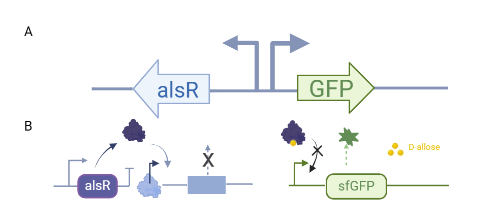

##Directed evolution of the alsR transcription factor to construct a D-allose biosensor

Chenxi Lu, Mengyu Li, Jie Zhang, Yuting Lu, Lin Li, Ying Zhang, Yufan Zhou, Yuan Fang, Yi Cao, Yongye Wu, Jiaqi Zhang, Zeyu Yan, Gongrui Meng, Rui Long, Li Yang, Wei Liu*, Yang Sun, Liying Zhu, Ling Jiang*

*-Corresponding authors contributed equally

##Abstract
  D-allose is a rare monosaccharide that is infrequently found in the natural environment. Being 80% sweeter than sucrose, D-allose is characterized by its extremely low caloric content and non-toxic properties, positioning it as an ideal substitute for sucrose in various food products. Its unique health benefits and physiological functions have been evidenced in diverse fields, including food systems, clinical treatments, and healthcare. However, its chemical synthesis poses significant challenges. In recent years, the biotechnological production of D-allose has emerged as a prominent area of research. This study presented a redesigned genetically encoded biosensor based on a D-allose regulatory gene for real-time monitoring of D-allose levels. Directed evolution of the transcriptional factor alsR gene yielded mutants with enhanced affinity for D-allose and improved detection sensitivity. The reconstructed biosensor was effectively utilized to detect intracellular D-allose synthesis, offering a potential selection tool for the directed evolution of enzymes associated with D-allose synthesis.

**Key words**: biosensor, D-allose, transcriptional factor

##Introduction
  The International Society of Rare Sugars (ISRS) defines the eponymous "rare sugars" whose derivatives are monosaccharides that are nearly nonexistent in nature. Despite their extremely low natural abundance, rare sugars exhibit various known biological functions and possess significant developmental potential in the synthesis, cosmetics, pharmaceuticals, food, and flavor industries[1]. D-allose is an important rare sugar, 80% sweeter than sucrose, and it is a super-low-calorie and ideal substitute for table sugar[2]. Although it is rarely found in nature, D-allose has garnered considerable research interest in recent years due to its numerous pharmacological activities, including anticancer, antitumor, anti-inflammatory, antioxidant, antihypertensive, cryoprotective, and immunosuppressive properties. D-allose inhibits the proliferation of cancer cells to prevent carcinogenesis, and in combination with radiotherapy, it has been proven to be an effective cancer treatment[3-5]. As an antioxidant, it can prevent ROS-mediated oxidative damage and reduce the generation of free radicals, thereby delaying deterioration. D-allose also protects against ischemia-reperfusion injury, decreases neutrophil production, and reduces platelet count by acting as an anti-inflammatory agent[6-7]. Furthermore, D-allose exhibits cryoprotective functions during freezing that are comparable to those of trehalose, and as an immunosuppressant, it can enhance the survival rate of allogeneic transplants and reduce tissue damage[8]. Therefore, D-allose has emerged as a novel functional food nutrient enhancer[9]. Unfortunately, most rare sugars, including D-allose, are prohibitively expensive, and their limited natural availability may impede their industrial potential.

  The rapid advancement of synthetic biology has facilitated the biosynthesis of D-allose. However, challenges remain, including the low activity and stability of the enzymes, as well as the low productivity and yield of strains involved in D-allose synthesis[10]. To enhance the performance of enzymes for D-allose production, directed evolution presents a promising strategy. However, there is currently a lack of high-throughput selection methods specifically for D-allose. Genetically encoded biosensors offer the capability to detect fluctuations in metabolite concentrations both intracellularly and extracellularly, as well as in the surrounding environment[11]. These biosensors can generate measurable signal outputs or modulate gene expression levels within the metabolic pathway, providing a cost-effective, straightforward, and reproducible approach to monitoring and optimizing biosynthetic processes[12-13].  

  In this study, we developed a D-allose detection biosensor system utilizing the specific D-allose-responsive transcriptional regulator alsR in Escherichia coli to dynamically monitor D-allose levels. Further directed evolution of alsR yielded a biosensor with enhanced sensitivity, thereby providing a potential selection tool for the directed evolution of enzymes related to D-allose synthesis.

##Results
###*Design of a biosensor for D-allose*
  *E. coli* K-12 can utilize D-allose as its sole carbon source. The operon responsible for D-allose metabolism is located at 92.8 minutes on the E. coli chromosome map and consists of six genes, alsRBACEK, which are transcriptionally induced by D-allose and negatively regulated by alsR (Figure 1). The alsBAC genes are involved in the translocation of D-allose, AlsE is the putative D-allose-6-phosphate 3-epimerase, and AlsK is the putative D-allose kinase. Previous studies have indicated that the region between the rpiB and alsR genes is predicted to function as a bidirectional promoter, and the transcription of the rpiB gene (encoding the allose-6-phosphate 3-epimerase) is similarly induced by D-allose, with suppression mediated by the alsR negative feedback loop[14].

 
  
Figure 1 The operon responsible for D-allose metabolism in Escherichia coli K-12

  *E. coli* BL21(DE3), a derivative of the K-12 strain, contains the als operon on its genome and thus harbors a natural alsR expression frame. We cloned the promoter region between the rpiB and alsR genes and ligated the fluorescent protein sfGFP to the promoter in the rpiB direction. This construct was then cloned into the pCDFDuet-1 vector, resulting in the recombinant plasmid pCDFDuet-1-PalsI-sfGFP. After transfecting this plasmid into BL21(DE3), the resulting recombinant strain *E. coli* BL21(DE3)/pCDFDuet-1-PalsI-sfGFP exhibited green fluorescence on LB plates without the addition of D-allose. We hypothesized that a single copy of the alsR expression frame on the *E. coli* BL21(DE3) genome might not fully repress sfGFP expression from the multicopy plasmid. Therefore, we attempted to overexpress alsR on the plasmid to enhance its repression.

  We further cloned the bidirectional promoter sequence along with the alsR gene into the pETDuet-1 plasmid, creating the recombinant plasmid pETDuet-1-nativeP-alsR. Both pETDuet-1-nativeP-alsR and pCDFDuet-1-PalsI-sfGFP were simultaneously introduced into BL21(DE3), resulting in the recombinant strain *E. coli* BL21(DE3)/pCDFDuet-1-PalsI-sfGFP/pETDuet-1-nativeP-alsR. At this stage, we observed that the strain appeared white on LB plates in the absence of D-allose, indicating successful repression of sfGFP expression. The fluorescence dose-response behavior of *E. coli* BL21(DE3)/pCDFDuet-1-PalsI-sfGFP/pETDuet-1-nativeP-alsR was further investigated using D-allose as the input. Different concentrations of D-allose were added to assess its effect on sfGFP expression. We observed that in the dual-plasmid sensor system, the fluorescence signal increased progressively with higher concentrations of D-allose, showing a strong positive correlation between fluorescence intensity and D-allose concentration (Figure 2). This result confirmed that the biosensor for D-allose was successfully constructed.

 
  
Figure 2 Effect of different concentrations of D-allose on the fluorescence intensity of E. coli BL21(DE3)/pCDFDuet-1-PalsI-sfGFP/pETDuet-1-nativeP-alsR
  

  Although the dual plasmid system of pCDFDuet-1-PalsI-sfGFP/pETDuet-1-nativeP-alsR successfully constructed the D-allose biosensor, the dual plasmid posed a significant burden on the cells. To address this, we aimed to express both alsR and sfGFP modules on a single plasmid by leveraging the bidirectional promoter. We cloned the alsR gene, bidirectional promoter, and sfGFP into the pCDFDuet-1 plasmid vector, creating the recombinant plasmid pCDFDuet-1-alsR-P-sfGFP. This plasmid was transfected into BL21(DE3), resulting in the recombinant strain *E. coli* BL21(DE3)/pCDFDuet-1-alsR-P-sfGFP, where the bidirectional promoter simultaneously initiates the expression of the transcriptional regulator alsR and the reporter gene sfGFP (Figure 3).

 
  
Figure 3 Schematic of D-allose biosensor based on a single plasmid system in E. coli BL21(DE3)/pCDFDuet-1-alsR-P-sfGFP
  

   Further, the fluorescence dose-response behavior of E. coli BL21(DE3)/pCDFDuet-1-alsR-P-sfGFP was investigated using D-allose as the input, with the results shown in Fig. 4. As the D-allose concentration increased, the fluorescence signal readings of the bacterial culture exhibited a graded intensification, indicating a strong positive correlation between fluorescence intensity and D-allose concentration.

Figure 4 Effect of different concentrations of D-allulose on the fluorescence intensity of E. coli BL21(DE3)/pCDFDuet-1-alsR-P-sfGFP
  

##*Directed evolution of alsR*
  Given that the single plasmid biosensors described above were not sufficiently sensitive to D-allose, we initiated directed evolution of the transcription factor alsR in an effort to enhance the biosensor's sensitivity to D-allose. Random mutant libraries were generated using an error-prone PCR method. The alsR gene was randomly mutated and self-selected by the biosensor using a microplate reader (Figure 5). 

Figure 5 Schematic of the directed evolution of alsR gene based on random mutation.
  
  Approximately 200 mutants displaying green coloration on the LB plates were selected and cultured, and their fluorescence was measured using a microplate reader. Around 10 mutants exhibited higher fluorescence levels. As shown in Figure 6, the M2 mutant demonstrated the highest fluorescence intensity. Gene sequencing was performed to identify its mutation sites, and the results are shown in Figure 7. The alsR repressor protein in M2 mutant had mutations at the following positions: Glu25, Phe73, Thr83, Val93, Asp106, Phe264, Asn279, and Gln281.
  

Figure 6 Fluorescence values of wild-type and ten mutants of alsR with addition of 0 mM and 20 mM D-allose. WT: Wild-type alsR, 2-10: mutants of alsR.
  

Figure 7 Schematic representation of the amino acid mutation sites of alsR in M2 mutant compared to the wild type.
  

  To investigate the underlying mechanism, modeling and docking analyses of the mutant M2 and wild-type alsR proteins were performed. As shown in Figure 8a, it was observed that in the wild-type alsR, residues Ile125, Ile236, and Cys238 formed five hydrogen bonds with D-allose. In contrast, the mutant alsR-muta complex (with mutations) involved Asn127, Ile236, and Cys238 forming six hydrogen bonds with D-allose. This increase in hydrogen bonding indicates a stronger affinity between the mutant alsR-muta and D-allose, suggesting that the mutations improved the binding efficiency and overall sensitivity of the biosensor to D-allose.
  
  Subsequently, molecular dynamics simulations of the alsR-allose and alsR-muta-allose complexes were conducted for 100 ns (Figure 8b). The results indicated that the root mean square deviation (RMSD) of the wild-type alsR was approximately 0.75 nm. Although the RMSD exhibited some fluctuations, it ultimately converged, suggesting relative stability. In contrast, the mutant alsR-muta displayed an RMSD of about 0.3 nm during the first 0-50 ns, indicating greater stability compared to the wild type. However, from 50 ns onwards, the RMSD began to increase, reaching approximately 0.8 nm, which signifies that the alsR-muta structure experienced a sudden loss of stability at that point.

  During the 100 ns simulation, the binding interactions of alsR-allose and alsR-muta-allose were observed. It was found that both alsR and D-allose maintained a stable binding conformation throughout the simulation period, with no significant change in the spatial position of D-allose in the wild-type complex. In contrast, for alsR-muta, between 60-70 ns, the affinity between D-allose and alsR-muta decreased, leading to the exclusion of allose from the binding site of alsR-muta. This observation suggests that the structural stability of the mutant may have been compromised, impacting its ability to retain D-allose.
  
  In summary, the enhanced induction observed in the mutant alsR can be attributed to two key phases: initially, there is an increase in affinity between alsR-muta and D-allose, resulting in a stable conformation. However, in the later stage, this affinity decreases abruptly, leading to the "squeezed out" of D-allose from the binding site. This allows the D-allose released from alsR-muta to be available for subsequent rounds of induction, thereby increasing induction efficiency. Consequently, high induction efficiency can be achieved even at lower concentrations of D-allose.

