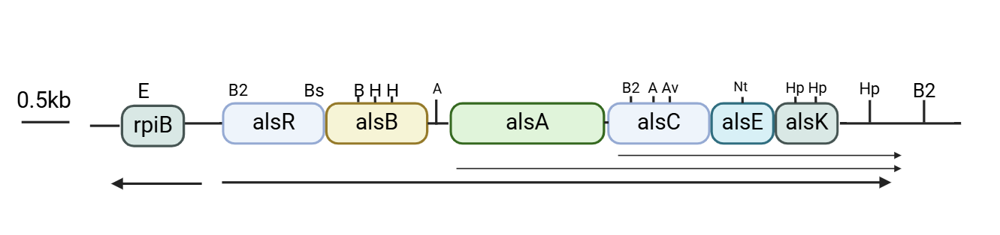
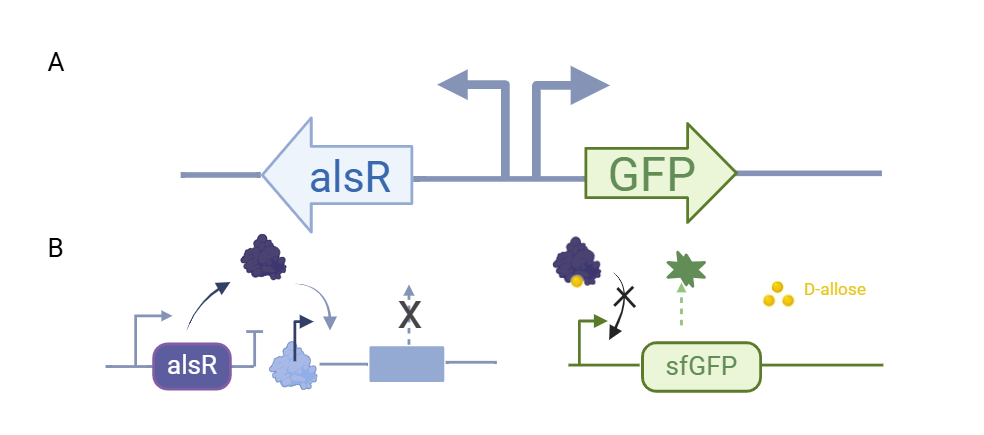
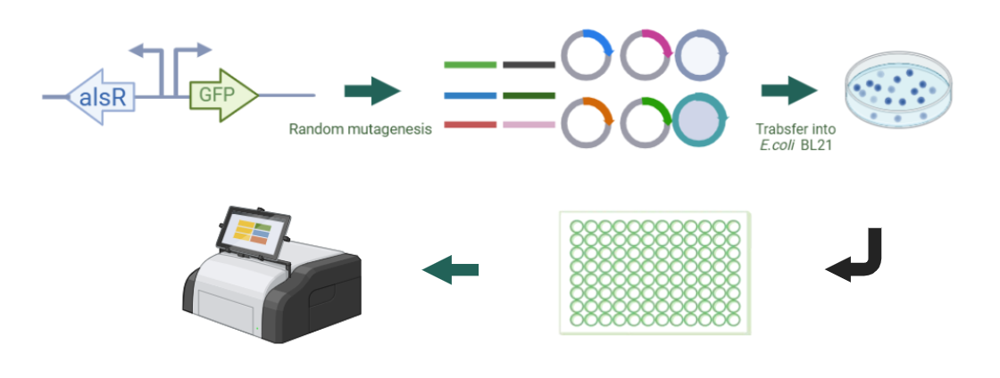

#Design

##Design of a biosensor for D-allose

  *E. coli* K-12 can utilize D-allose as its sole carbon source. The operon responsible for D-allose metabolism is located at 92.8 minutes on the *E. coli* chromosome map and consists of six genes, alsRBACEK, which are transcriptionally induced by D-allose and negatively regulated by alsR (Figure 1). The alsBAC genes are involved in the translocation of D-allose, AlsE is the putative D-allose-6-phosphate 3-epimerase, and AlsK is the putative D-allose kinase. Previous studies have indicated that the region between the rpiB and alsR genes is predicted to function as a bidirectional promoter, and the transcription of the rpiB gene (encoding the allose-6-phosphate 3-epimerase) is similarly induced by D-allose, with suppression mediated by the alsR negative feedback loop[1].
   
  
Figure 1 The operon responsible for D-allose metabolism in Escherichia coli K-12

  *E. coli* BL21(DE3), a derivative of the K-12 strain, contains the als operon on its genome and thus harbors a natural alsR expression frame. We cloned the promoter region between the rpiB and alsR genes and ligated the fluorescent protein sfGFP to the promoter in the rpiB direction. This construct was then cloned into the pCDFDuet-1 vector, resulting in the recombinant plasmid pCDFDuet-1-PalsI-sfGFP. After transfecting this plasmid into BL21(DE3), the resulting recombinant strain *E. coli* BL21(DE3)/pCDFDuet-1-PalsI-sfGFP exhibited green fluorescence on LB plates without the addition of D-allose. We hypothesized that a single copy of the alsR expression frame on the *E. coli* BL21(DE3) genome might not fully repress sfGFP expression from the multicopy plasmid. Therefore, we attempted to overexpress alsR on the plasmid to enhance its repression.

##Construction of pETDuet-1-nativeP-alsR plasmid and construction of dual plasmid biosensor system

  We further cloned the bidirectional promoter sequence together with the alsR sequence onto the pETDuet-1 plasmid to construct the recombinant plasmid pETDuet-1-nativeP-alsR.
  pETDuet-1-nativeP-alsR was introduced into BL21(DE) simultaneously with pCDFDuet-1-Palsl-sfGFP, and recombinant strain BL21(DE) /pCDFDuet-1-Palsl-sfGFP/pETDuet-1-nativeP-alsR was obtained. At this time, we found that on the LB plates, without the addition of D-allose, the strain appeared white.

##Construction of pCDFDuet-1-alsR-P-sfGFP plasmid and construction of single plasmid biosensor system
  Although the dual plasmid system of pCDFDuet-1-Palsl-sfGFP/pETDuet-1-nativeP-alsR was able to achieve the successful construction of the D-allose biosensor, the dual plasmid was more burdensome for the cells. Therefore, we tried to achieve the expression module of alsR with sfGFP in both plasmids on one plasmid by taking advantage of the property of bidirectional promoter. We cloned the sequences of alsR, bidirectional promoter and sfGFP into pCDFDuet-1 plasmid vector to construct the recombinant plasmid pCDFDuet-1-alsR-P-sfGFP. the recombinant plasmid was transfected into BL21(DE)3, and the obtained recombinant strain BL21(DE)3/pCDFDuet-1-alsR-P-sfGFP.
  
  where the bidirectional promoter initiates the expression of the transcriptional regulator alsR as well as the reporter gene sfGFP, respectively (Figure 2).
  
  
Figure. 2 D-allose biosensor based on single plasmid system

##Directed evolution of alsR
  Given that the single plasmid biosensors described above were not sufficiently sensitive to D-allose, we initiated directed evolution of the transcription factor alsR in an effort to enhance the biosensor's sensitivity to D-allose. Random mutant libraries were generated using an error-prone PCR method. The alsR gene was randomly mutated and self-selected by the biosensor using a microplate reader (Figure 3). 
    
  
Figure 3 Schematic of the directed evolution of alsR gene based on random mutation.

  
  Approximately 200 mutants displaying green coloration on the LB plates were selected and cultured, and their fluorescence was measured using a microplate reader. 

##References:
1. T.S. Poulsen, Y.Y. Chang, B. Hovejensen, D-allose catabolism of Escherichia coli: Involvement of alsI and regulation of als regulon expression by allose and ribose, Journal of Bacteriology, 181, 7126-7130(1999). 

  
