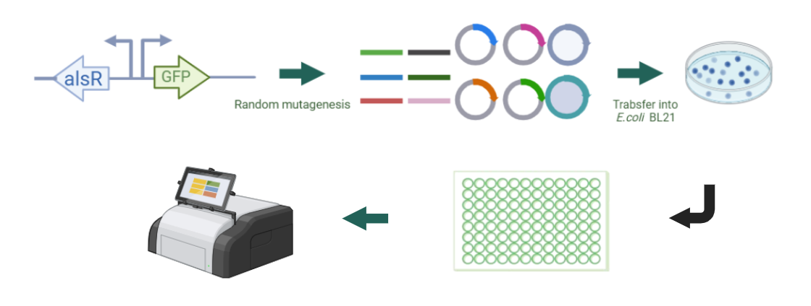

# Results

##Directed evolution of alsR
  Given that the single plasmid biosensors described above were not sufficiently sensitive to D-allose, we initiated directed evolution of the transcription factor alsR in an effort to enhance the biosensor's sensitivity to D-allose. Random mutant libraries were generated using an error-prone PCR method. The alsR gene was randomly mutated and self-selected by the biosensor using a microplate reader (Figure 1). 
  
  
Figure 1 Schematic of the directed evolution of alsR gene based on random mutation

  Approximately 200 mutants displaying green coloration on the LB plates were selected and cultured, and their fluorescence was measured using a microplate reader. Around 10 mutants exhibited higher fluorescence levels. As shown in Figure 6, the M2 mutant demonstrated the highest fluorescence intensity. Gene sequencing was performed to identify its mutation sites, and the results are shown in Figure 3. The alsR repressor protein in M2 mutant had mutations at the following positions:   
  
Figure 2 Fluorescence values of wild-type and ten mutants of alsR with addition of 0 mM and 20 mM D-allose. WT: Wild-type alsR, 2-10: mutants of alsR.

  
  
Figure 3 Schematic representation of the amino acid mutation sites of alsR in M2 mutant compared to the wild type.

  
  To investigate the underlying mechanism, modeling and docking analyses of the mutant M2 and wild-type alsR proteins were performed. As shown in Figure 4a, it was observed that in the wild-type alsR, residues Ile125, Ile236, and Cys238 formed five hydrogen bonds with D-allose. In contrast, the mutant alsR-muta complex (with mutations) involved Asn127, Ile236, and Cys238 forming six hydrogen bonds with D-allose. This increase in hydrogen bonding indicates a stronger affinity between the mutant alsR-muta and D-allose, suggesting that the mutations improved the binding efficiency and overall sensitivity of the biosensor to D-allose.
  
  Subsequently, molecular dynamics simulations of the alsR-allose and alsR-muta-allose complexes were conducted for 100 ns (Figure 4b). The results indicated that the root mean square deviation (RMSD) of the wild-type alsR was approximately 0.75 nm. Although the RMSD exhibited some fluctuations, it ultimately converged, suggesting relative stability. In contrast, the mutant alsR-muta displayed an RMSD of about 0.3 nm during the first 0-50 ns, indicating greater stability compared to the wild type. However, from 50 ns onwards, the RMSD began to increase, reaching approximately 0.8 nm, which signifies that the alsR-muta structure experienced a sudden loss of stability at that point.
  
  During the 100 ns simulation, the binding interactions of alsR-allose and alsR-muta-allose were observed. It was found that both alsR and D-allose maintained a stable binding conformation throughout the simulation period, with no significant change in the spatial position of D-allose in the wild-type complex. In contrast, for alsR-muta, between 60-70 ns, the affinity between D-allose and alsR-muta decreased, leading to the exclusion of allose from the binding site of alsR-muta. This observation suggests that the structural stability of the mutant may have been compromised, impacting its ability to retain D-allose.
  
  In summary, the enhanced induction observed in the mutant alsR can be attributed to two key phases: initially, there is an increase in affinity between alsR-muta and D-allose, resulting in a stable conformation. However, in the later stage, this affinity decreases abruptly, leading to the "squeezed out" of D-allose from the binding site. This allows the D-allose released from alsR-muta to be available for subsequent rounds of induction, thereby increasing induction efficiency. Consequently, high induction efficiency can be achieved even at lower concentrations of D-allose.
  
  
Figure 4 (a) The molecular docking of alsR and alsR-muta with D-allose. (b) the 100 ns molecular dynamics simulations of alsR and alsR-muta at 300 K. The spatial position of D-allose within alsR (c) and alsR-muta (d) at different time points during the 100 ns simulation.

  
##Specificity analysis of the D-allose biosensor
  Currently, the enzymatic synthesis of D-allose primarily involves a three-step biotransformation reaction. The first step entails the conversion of D-glucose to D-fructose, catalyzed by xylose isomerase. In the second step, D-tagatose-3-episomerase or D-allulose-3-episomerase facilitates the isomerization at the C3 position of D-fructose to produce D-allulose. Finally, D-allulose is converted to D-allose under the catalysis of aldose isomerase[1].
  
  To assess the specificity of the biosensor, we investigated the effects of different concentrations of glucose, fructose, and D-allulose on the fluorescence intensity of the biosensor. The results, shown in Figure 5, indicated that the fluorescence changes were minimal at varying concentrations of glucose, fructose, and D-allulose. As for D-allose, the fluorescence intensity exhibited a dose-dependent effect with increasing D-allose concentration (0-20 mM). This suggests that the constructed biosensor exhibits good specificity for D-allose.

  
  
Figure 5 Effect of different concentrations of D-allulose, D-allose, glucose and fructose on the fluorescence intensity of the biosensor

##Application of intracellular D-allose synthesis monitoring
  To evaluate the practical application of the biosensor, we selected the intracellular reaction catalyzed by ribose 5-phosphate isomerase (RpiB) for the synthesis of D-allose from allulose as a case study. We constructed an RpiB-expressing strain, E. coli BL21(DE3)/pET28a-rpiB, and introduced the mutated biosensor plasmid pCDFDuet-1-alsR*-P-sfGFP. By adding different concentrations of allulose, we assessed the fluorescence response of the biosensor. As shown in Figure 6, the fluorescence signal readings intensified with increasing concentrations of D-allulose (0-250 mM) in strains containing the biosensor, demonstrating its potential as a high-throughput selection tool for the directed evolution of enzymes associated with D-allose synthesis.

  
  
Figure 6 Effect of different concentrations of D-allulose to the sensitivity on the fluorescence intensity of the biosensor in vivo.

##References:
1. K. Morimoto, T. Suzuki, H. Ikeda, One-pot multi-step transformation of D-allose from d-fructose using a co-immobilized biocatalytic system, Journal of General and Applied Microbiology, 68, 1-9, (2022). 

  
  
