# Our Team

##Wet Lab
 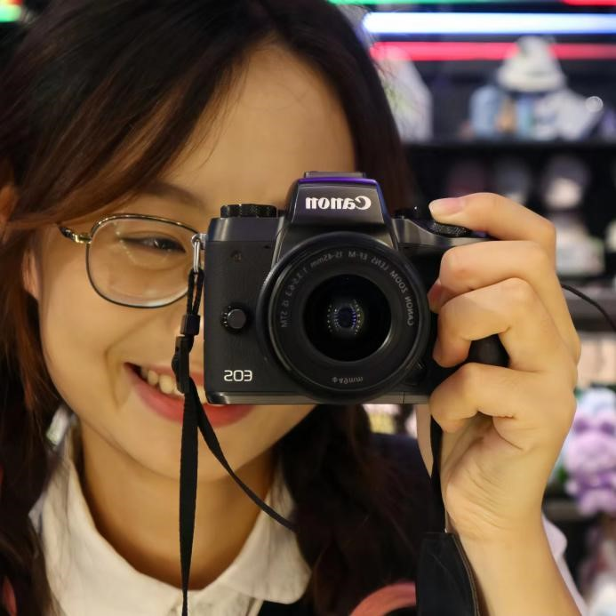
 
###Lin Li
 Hello everyone, my name is Li Lin and my major is bioengineering. I'm very happy to be a member of NJtech-China-A. I hope to learn more experimental skills, spread more knowledge about synthetic biology and meet more excellent people through iGEM. Eventually, we hope that our project will be helpful to the society.

  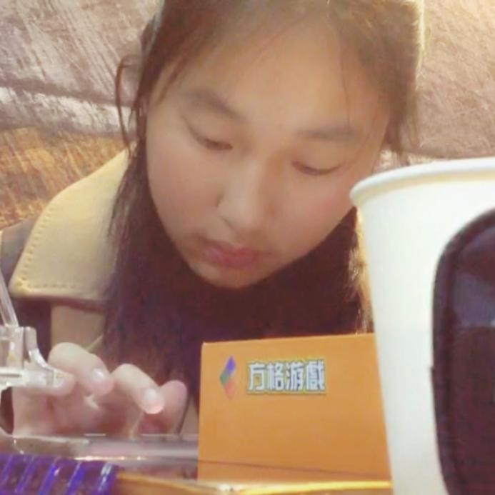 

###Yi Cao
My name is yiCao, and I'm a college student majoring in Food Science and Engineering at Nanjing Tech University Tech. In my spare time, I love painting, such as reading and playing sports. I believe that these activities not only enrich my personal life but also help me develop essential skills like teamwork and leadership.As I continue my academic journey, I'm looking forward to gaining practical experience and applying my knowledge to real-world problems. I'm open to new challenges and adventures, and I'm confident that my time at university will help me grow both personally and professionally.

  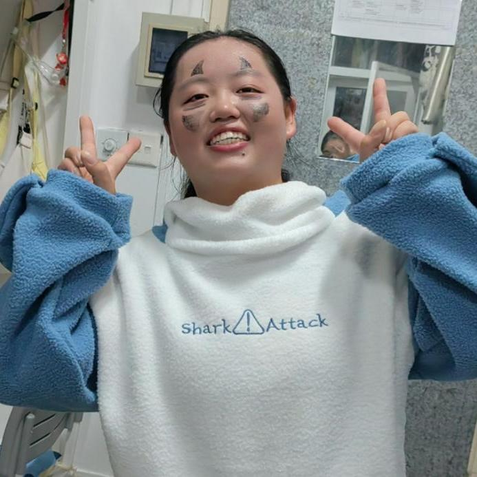

###Yuting Lu
 Hello everyone, I'm Yuting Lu from Food Science and Engineering. I have a strong interest in Synthetic Biology and feel honored to be a part of the iGEM team. As a member of our school's iGEM team, I have the opportunity to apply the knowledge and skills I have acquired to accumulate practical experience in solving real-world problems. I hope to improve myself and progress together with everyone through the opportunity provided by this iGEM competition！

  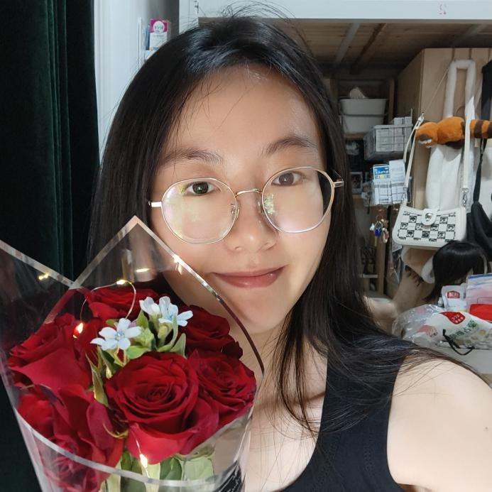

###Chenxi Lu
Know the shortage and forge ahead, look at the distant mountains and practice.

  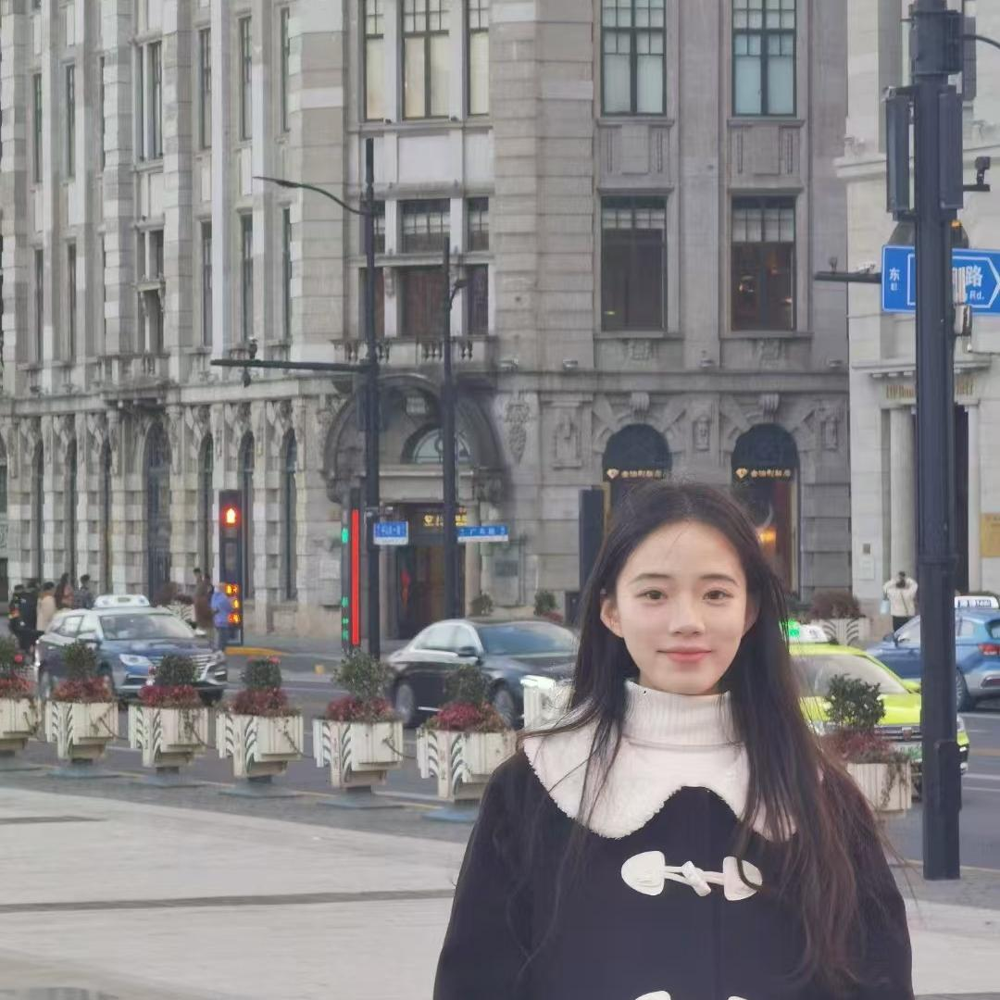
 
###Yuan Fang
My name is Yuan Fang, a junior student majoring in pharmaceutical engineering in Nanjing University of Technology. I love biological research and biological experiments. I have learned a lot of biological experiment knowledge and biological testing methods during this competition, which is a very valuable experience.

  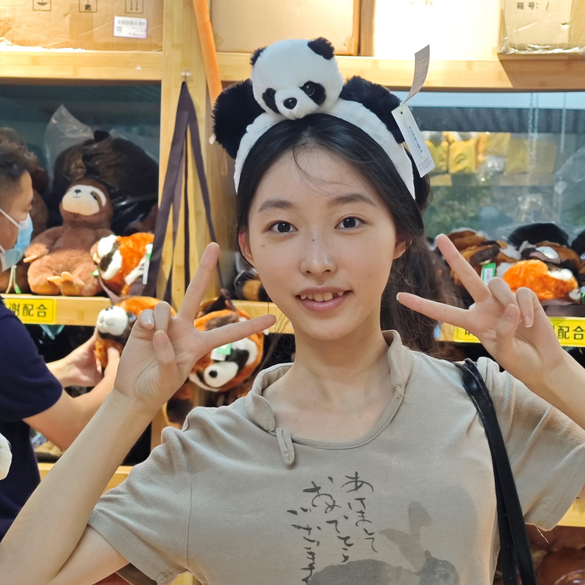

###Ying Zhang
Hello！ My name is Ying Zhang, and I'm excited to introduce myself. I’m passionate about conducting experiments related to synthetic biology. I believe in continuous learning and love meeting new people. I’m eager to share ideas and collaborate. In my free time, you can find that I enjoy reading, listening to music, and hiking.

##Model
  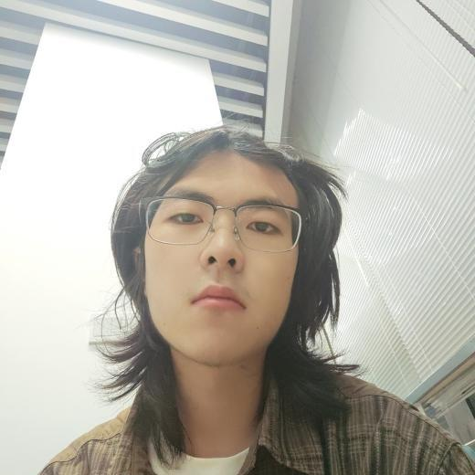

###Zeyu Yan
My name is Yan Zeyu, from Nanjing University of Technology. In this iGEM competition, I completed homology modeling, molecular docking, molecular dynamics simulation and mutation point prediction and interpretation in the digital and analog part. I am very happy to participate in this iGEM competition and meet like-minded teammates, I hope we can achieve good results!

  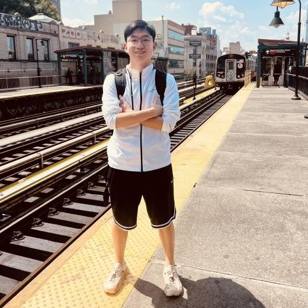
###YongYe Wu
My name is Yongye Wu,majoring in Electrical Engineering and Automation from Nanjing University of Technology, and I am responsible for the mathematical modeling part of igem. I like basketball, football, and my favorite teams are Celtic and Bayern Munich. My future goal is to study in Boston. I am very happy to participate in this competition and meet many new friends.

  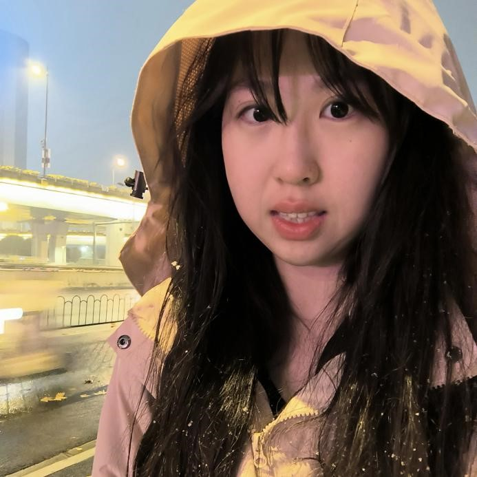
###Jiaqi Zhang 
Hello, my name is Zhang Jiaqi,responsible for the writing of the wiki website code. My undergraduate major is electronic engineering, and I hope to conduct in depth study in the direction of integrated circuits at the graduate stage. I am good at using HTML, CSS, JavaScript, Vue and other front-end technologies. I have a deep understanding of the front-end field, and I can develop high-quality, usable, high-performance front-end pages and applications.

##HP
 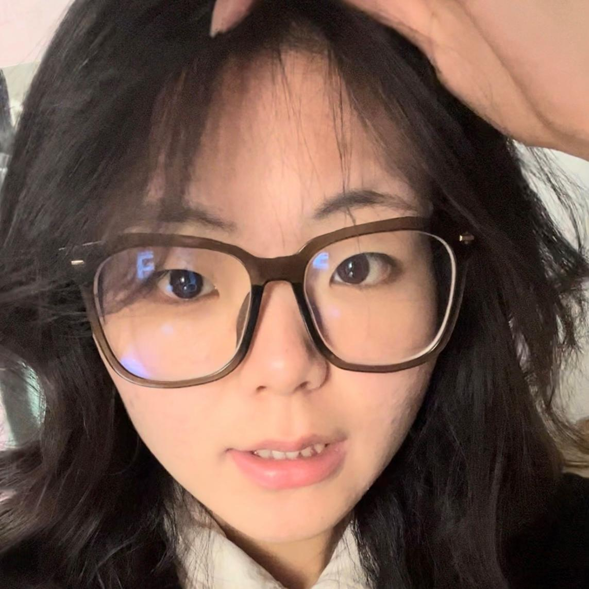
###Yufan Zhou
Hello everyone, I am Yufan Zhou, the leader of the HP group of our team. In this iGEM competition, I gained a lot of knowledge and friendship. In order to promote synthetic biology, we went to many places, met different people, organized many activities, recorded wonderful videos, and sent dozens of tweets. Although the process is tiring, we hope that our contribution will spread knowledge further and let more people know about synthetic biology.

##Advisor

 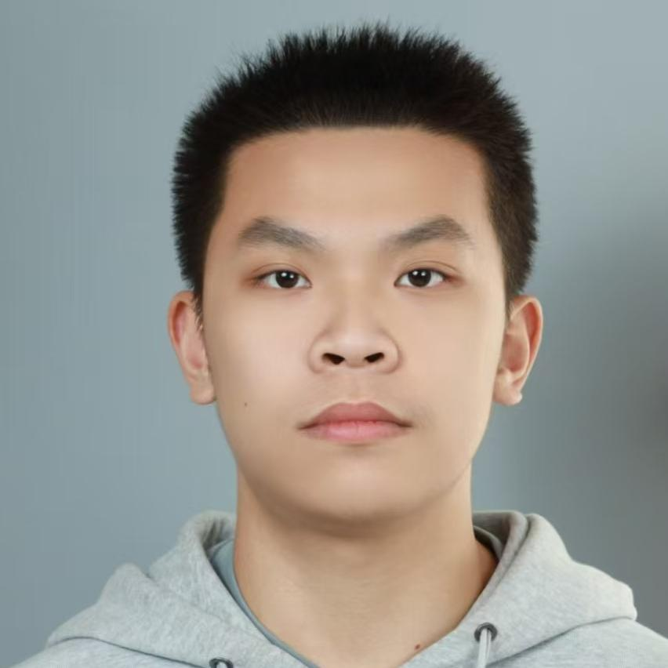
###Gongrui Meng
Hello, I'm Meng Gongrui, and my major is food science and engineering. The days of working on the iGEM project are very interesting, and we look forward to more and more partners joining us.

 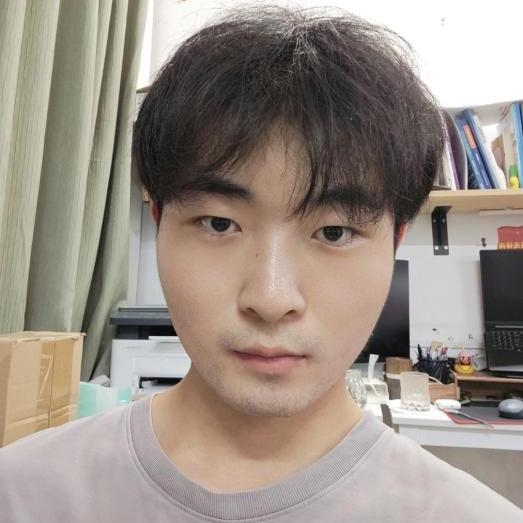
###Gongrui Meng
hello everyone I am Rui Long a master s student in Professor Jiang Ling s research group at Nanjing University of Technology In my free time I enjoy playing basketball I mainly participate in biotechnology and synthetic biology experiments Through the iGEM project we hope to contribute to the sustainable development of social health and the environment

 
###Li Yang
Greetings, everyone！ I'm Li Yang, and I come from Prof.Ling Jiang's team at Nanjing Tech Univercity. Our research focuses on rare sugar biosynthesis research, dedicated to developing new biotechnologies and exploring the forefront of sugar science. It is my great honor to introduce the progress of our project and communicate with you.

 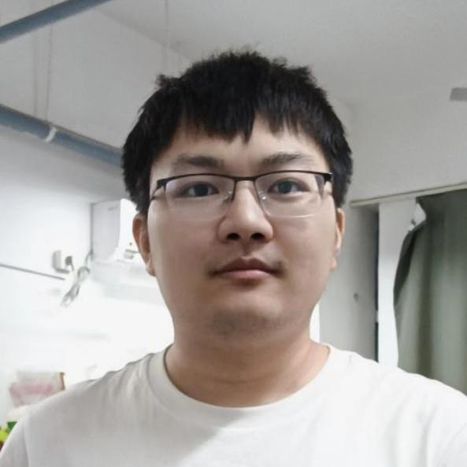
###Jie Zhang
Hello everyone, I'm Jie Zhang, from Dr. Ling Jiang's research team at Nanjing Tech University. I am particularly captivated by biology, especially the niche area of molecular biology, which I find to be endlessly fascinating and full of mysteries, prompting me to want to learn more about this field. As a natural optimist, I enjoy spending my free time playing badminton with friends to alleviate the stress of studying. I'm thrilled to share with you our recent research work and sincerely hope to gain your support. Thank you！

 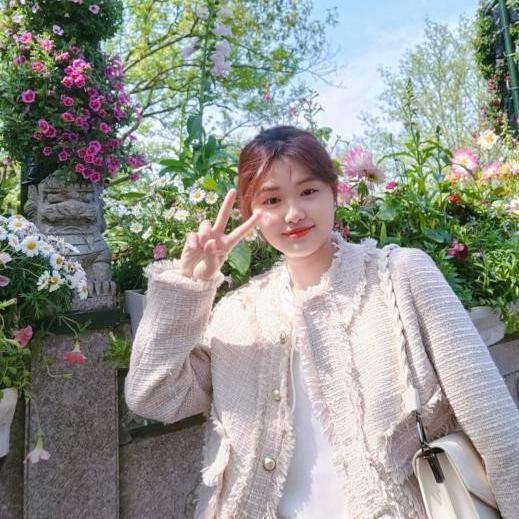
###Mengyu Li
Hello everyone！ I'm Mengyu Li, a master's student in Professor Jiang Ling's research group at Nanjing Tech University. In my free time, I enjoy playing badminton and swimming. I am passionate about biotechnology and synthetic biology. By participating in the iGEM project, I hope to collaborate with peers from around the world to explore new applications of biotechnology, contributing to societal health and sustainable development of the environment.

##PI

 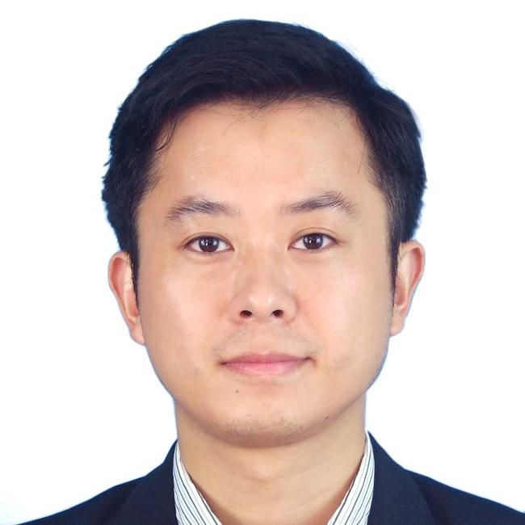
###Ling Jiang
Since 2017, he has been a full professor at the College of Food and Light Industry of Nanjing Tech University. He has been engaged in the conservation and development of extreme microbial resources and food enzyme resources for a long time and carried out basic theoretical research and applied technology research in the common key technologies and research methodologies of biocatalysis and biotransformation.

 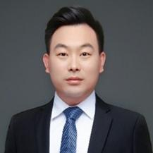
###Wei Liu
The main focus is on enzyme engineering, microbial metabolic engineering, and synthetic biology, with an emphasis on the efficient biological synthesis of food nutrients. Key research activities include the construction of in vitro multienzyme cascades for functional sugars such as D-tagatose, trehalose, oligofructose, and human milk oligosaccharides, as well as the creation of cell factories.

 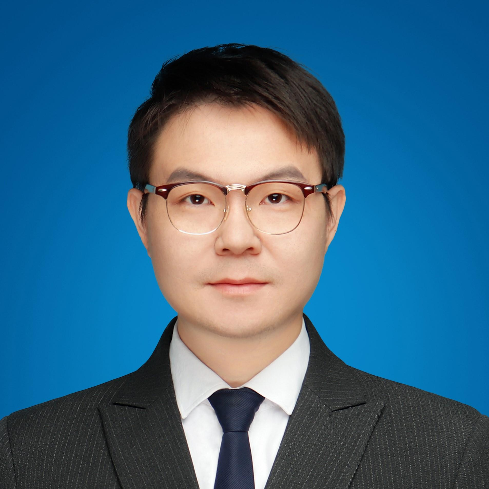
###Yang Sun
I am focusing on three key scientific issues: the discovery, modification, and efficient use of microorganisms and enzymes, this approach begins with the exploration and evaluation of microbial gene functions, rational enzyme engineering, and directed regulation of microbial metabolism. Through the interdisciplinary integration of bioinformatics, genetic engineering, enzyme engineering, synthetic biology, and fermentation engineering, a multi-level system based on synthetic biology is established. This system encompasses functional modules, metabolic networks, and precise regulation, aiming to create high-yield industrial microbial strains with independent national intellectual property rights.

 
###Liying Zhu
She is an associate professor at Nanjing Tech University. Mainly engaged in teaching and research in the fields of biocatalysis, biomaterials, and heavy metal treatment.
